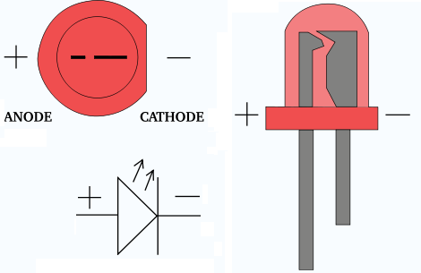

# Setup ESP32


## Configuration:
* OS: MacOS Catalina
* ESP32: [esp32-wroom-32 devkit](https://www.laskarduino.cz/iot-esp-32s-2-4ghz-dual-mode-wifi-bluetooth-rev-1--cp2102/)
* [Breadboard power supply module](https://www.laskarduino.cz/napajeci-modul-pro-breadboard/)

## Installation UART Virtual COM Driver
- https://www.silabs.com/products/development-tools/software/usb-to-uart-bridge-vcp-drivers

## Esptool

* Github: https://github.com/espressif/esptool

### installation esptool

```bash
pip3 install esptool
```

### Connect test + info about esp32

```
% ~/Documents/Arduino/hardware/espressif/esp32/tools/esptool/esptool --port /dev/cu.SLAB_USBtoUART flash_id
esptool.py v2.6
Serial port /dev/cu.SLAB_USBtoUART
Connecting......
Detecting chip type... ESP32
Chip is ESP32D0WDQ6 (revision 1)
Features: WiFi, BT, Dual Core, 240MHz, VRef calibration in efuse, Coding Scheme None
MAC: 24:62:ab:d7:04:a4
Uploading stub...
Running stub...
Stub running...
Manufacturer: 20
Device: 4016
Detected flash size: 4MB
Hard resetting via RTS pin...
```

## Installation Arduino IDE:

* Download: https://www.arduino.cc/en/main/software

**You need ESP32 boards for ESP32** installation:

```bash
mkdir -p ~/Documents/Arduino/hardware/espressif && \
cd ~/Documents/Arduino/hardware/espressif && \
git clone  https://github.com/espressif/arduino-esp32.git  esp32 && \
cd esp32/tools/ && \
python get.py
```
# ESP32 pinout


# LED blinking tutorial

## Circuit scheme


* Connect V5 to pin called 5V
* Connect GND to pin called GND
* Connect the 100Ωresistor to the pin called D5 on the ESP32.
* Connect the Anode of the LED to the end of the 100Ωresistor.
* Connect the Cathode of the LED to the pin called GND on the ESP32.



## Arduino IDE code, setup, source compiling and upload

```
#include <dummy.h>

int ledPin = 5;

void setup() {
  // put your setup code here, to run once:
    pinMode(ledPin, OUTPUT);
    Serial.begin(115200);
}

void loop() {
  // put your main code here, to run repeatedly:
    Serial.println("Hello, world!");
    digitalWrite(ledPin, HIGH);
    delay(500);
    digitalWrite(ledPin, LOW);
    delay(500);
}
```

* Select Tools-\>Board-\> `ESP32 Dev Module`
* Select `/dev/cu.SLAB_USBtoUART` in Tools->Port, -> 

* Verify and compile your code by `Sketch -> Verifiy/Compile`
* Upload to esp32 by `Sketch -> Upload`

**Now your LED didode should be blinking.**

## Troubleshooting

* **Q:** I gets `Resrouce busy` when I trying comunicate with esp32
* **A:** You have to use correct port: `/dev/cu.SLAB_USBtoUART`
```
Serial port /dev/cu.usbserial-0001
Traceback (most recent call last):
  File "esptool.py", line 2959, in <module>
    if esp.IS_STUB:
  File "esptool.py", line 2952, in _main
    esp.hard_reset()
  File "esptool.py", line 2646, in main
    help='What to do before connecting to the chip',
  File "esptool.py", line 258, in detect_chip
    except IOError:
  File "esptool.py", line 222, in __init__
    STATUS_BYTES_LENGTH = 2
  File "serial/__init__.py", line 88, in serial_for_url
  File "serial/serialposix.py", line 268, in open
serial.serialutil.SerialException: [Errno 16] could not open port /dev/cu.usbserial-0001: [Errno 16] Resource busy: '/dev/cu.usbserial-0001'
```


#### Source

Brief [manual](https://www.instructables.com/id/Getting-Started-With-ESP32-on-a-Mac-Blink-and-LED/) with non working links and missing steps and other mistakes
